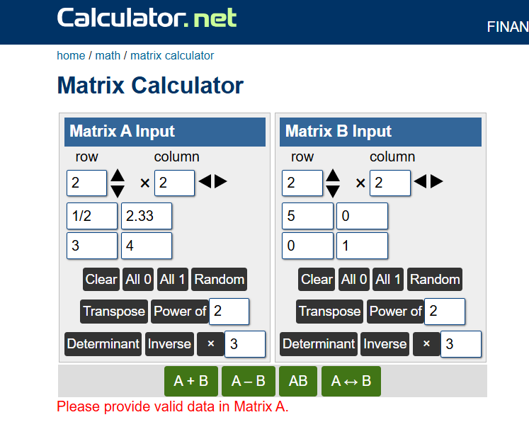
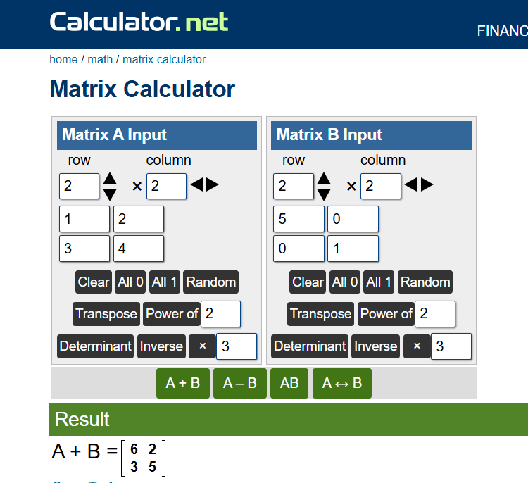

# 🔢 Matrix Operations Calculator

**A matrix calculator built entirely from scratch with Python OOP — the only one of its kind that natively understands fractions, decimals, and whole numbers, mixed freely, in the same matrix.**

🔗 **[Live Demo →](https://matrix-operations-qhdg4nygwrfywumupxfjvv.streamlit.app/)**


---

## ✨ What makes this different

Most online matrix calculators  only accept **plain numbers**. This project was built specifically to close that gap:

### I only use this picture as referance ... not for marketing or controversy **

**Fractions data get rejected:**


**Integers work fine:**


| | This calculator | Typical online matrix calculators |
|---|:---:|:---:|
| Whole numbers | ✅ | ✅ |
| Decimals | ✅ | ✅ |
| **Fractions (`a/b`) as native input** | ✅ | ❌ |
| **Mixed types in the same matrix** | ✅ | ❌ |
| **Automatic type promotion between elements** | ✅ | ❌ |
| Terminal / CLI version | ✅ | ❌ |
| Open source, self-hosted | ✅ | ❌ |

You can put `1`, `3/4`, and `2.5` **in the same matrix, side by side**, and every operation — addition, subtraction, multiplication, transpose, determinant, adjoint, inverse — resolves the result to the mathematically correct type automatically. No other calculator I checked supports this.

### The type-promotion engine

Built entirely from a hand-written `Fraction` class using Python's operator overloading (`__add__`, `__radd__`, `__sub__`, `__rsub__`, `__mul__`, `__rmul__`, `__truediv__`, `__rtruediv__`) — no external math library involved:

| Element A | Element B | Result |
|:---:|:---:|:---:|
| `int` | `int` | `int` |
| `float` | `float` | `float` |
| `Fraction` | `Fraction` | `Fraction` |
| `int` | `float` | `float` |
| `int` | `Fraction` | `Fraction` |
| `float` | `Fraction` | `float` |

This works in **both directions** (`3 + Fraction(1,2)` and `Fraction(1,2) + 3` both resolve correctly) thanks to Python's reflected magic methods — a detail most quick implementations miss.

---

## 🧮 Operations supported

- ➕ Addition
- ➖ Subtraction
- ✖️ Multiplication (scalar × matrix, and matrix × matrix)
- 🔄 Transpose
- 📐 Determinant *(recursive cofactor expansion — works for any n×n, not just 2×2/3×3)*
- 🧩 Adjoint
- 🔁 Inverse *(computed as `adjoint ÷ determinant`, fully symbolic when elements are fractions)*

---

## 🖥️ Two ways to use it

### 1. Terminal program
A menu-driven console app — pick an operation first, then enter only the matrix (or matrices) that operation actually needs.

```bash
python main.py
```

**Built-in safety:**
- Never crashes on bad input — re-prompts with a clear message instead
- Warns (rather than crashing) on dimension mismatches, non-square matrices for determinant/adjoint/inverse, and singular matrices

### 2. Web UI
The same logic, wrapped in an interactive Streamlit interface — no terminal required.

```bash
pip install -r requirements.txt
streamlit run app.py
```

**🔗 Or just use it live, right now:**
**https://matrix-operations-qhdg4nygwrfywumupxfjvv.streamlit.app/**

---

## 📁 Project structure
matrix_operations/
│
├── matrix.py            # Matrix class — add, sub, mul, transpose, determinant, adjoint, inverse
├── fraction.py            # Fraction class — a/b arithmetic with full type-promotion support
├── main.py                 # Terminal program (menu-driven, operation-first flow)
├── app.py                    # Streamlit web UI (reuses matrix.py & fraction.py directly)
├── requirements.txt            # Dependencies for the web UI
├── .gitignore                    # Keeps venv/, pycache/, etc. out of version control
└── README.md                       # You're reading it

Both the terminal program and the web UI import the **exact same** `matrix.py` and `fraction.py` — zero duplicated logic between the two interfaces.

---

## 🧠 Design highlights

- **Pure OOP, ground-up** — no `fractions` module, no `numpy`, no external math dependency for the core logic. Every operator (`+`, `-`, `*`, `/`) is manually overloaded via Python magic methods.
- **Recursive determinant/adjoint** — implemented via cofactor expansion, so it correctly handles any square matrix size, not hard-coded for 2×2/3×3 only.
- **Defensive input parsing** — a single `parse_element()` function decides whether a typed value is an `int`, `float`, or `Fraction`, shared identically between the terminal and web versions.
- **Fail gracefully, always** — every user-facing error (bad dimensions, non-square matrix, singular matrix, malformed input) surfaces as a clear, specific message — never a raw Python traceback.

---

## 📌 Example

**Input — Matrix A:**
1 , 3/4 //
2.5 ,  6

**Input — Matrix B:**
1/2 ,  3  //
2   ,  1.5

**A + B:**
3/2 ,  15/4  //
4.5 ,  7.5

Notice the result correctly mixes fractions and decimals in the *same* output matrix — exactly matching the type-promotion rules above.

---

## 🚀 Live deployment

Deployed on **Streamlit Community Cloud**, connected directly to this GitHub repository — every push to `main` automatically redeploys the live app.

**Try it here:** https://matrix-operations-qhdg4nygwrfywumupxfjvv.streamlit.app/

---

## 🛠️ Tech stack

- **Language:** Python 3
- **Web UI:** Streamlit
- **Version control:** Git + GitHub
- **Hosting:** Streamlit Community Cloud
- **Dependencies:** Just `streamlit` — the entire mathematical engine (`Fraction`, `Matrix`) is pure Python, zero external math libraries

---

